# Student Management
This is the English version of the README. For French, please see [README_FR.md](./README_FR.md).

## Description 

> This project involves a very simple desktop application for student management. The application is programmed in Java SE using Eclipse and connected to an ORACLE/SQL database. Its purpose is to enable the storage and processing of student grades, quick searches for both students and teachers, as well as a few queries.

## Tools and Development Environment

       <b> ORACLE/SQL </b>
    -- <b> JAVA ( JDK + JRE ) </b>
    -- <b> IDE ( Eclipse ) </b>

## What can be done with the application (Features)

1) The application is used by school administrators, and they can utilize the following features:

   - Save information about each student in the database (Insertion)
   - Save information about each teacher in the database (Insertion)
   - Display the list of students and teachers
   - Display the overall averages of students
   - Execute certain queries
  
<table align="center">
  <tr>
    <th> User </th>
    <th> Password </th>
  </tr>
  <tr>
    <td> BDDAdmin </td>
    <td> TPAdmin </td>
  </tr>
</table>

###### Presentation of Interfaces
<table align="center">
  <tr>
    <th  colspan="3"> Authentification </th>
  </tr>
  <tr>
    <td> 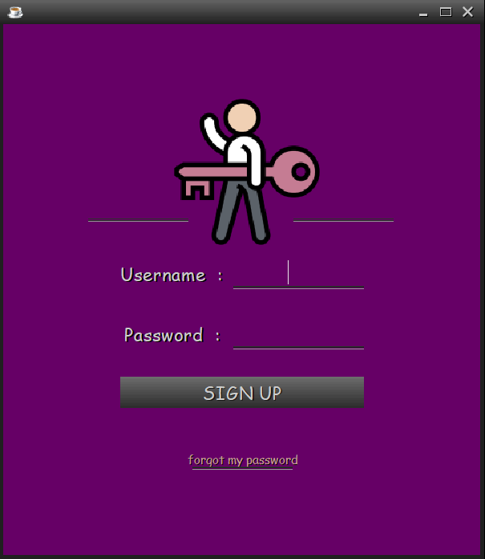  </td> <td> 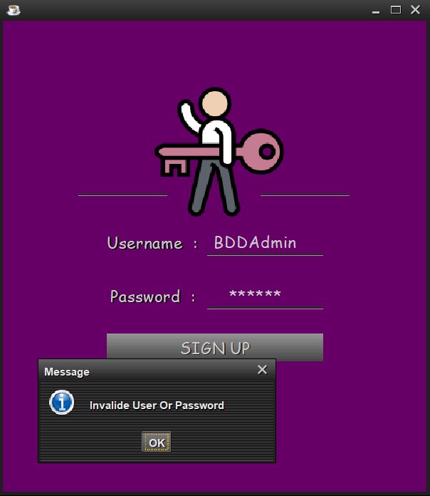 </td> <td>  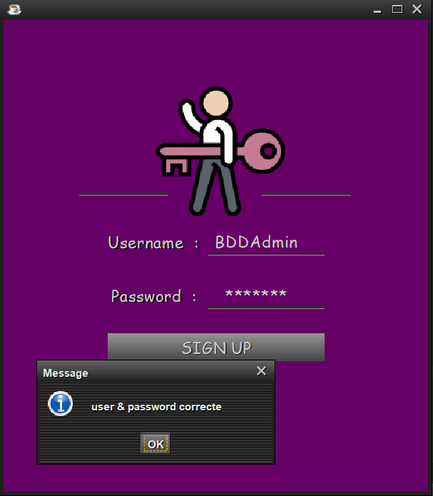 </td>
  </tr>
 </table>
<table align="center">
   <tr>
    <th colspan="3"> Home Page, Insertion and Display </th>
  </tr>
  <tr>
    <td > 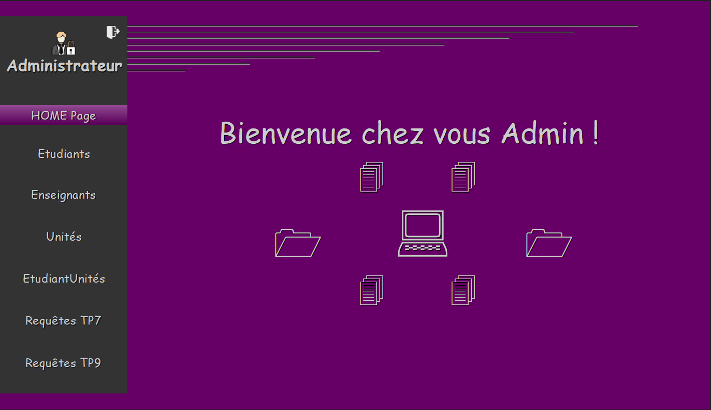 </td> <td> 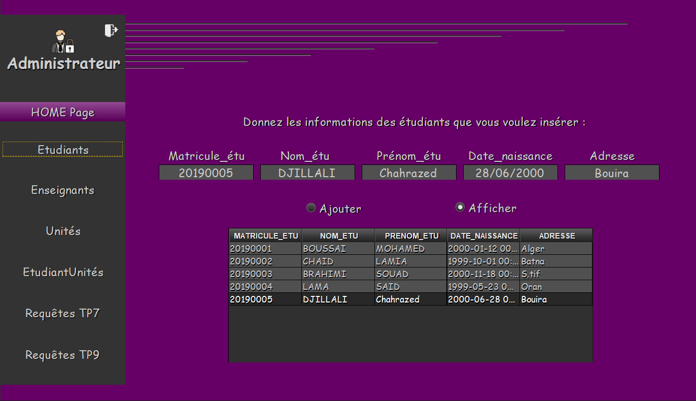  </td>  <td > 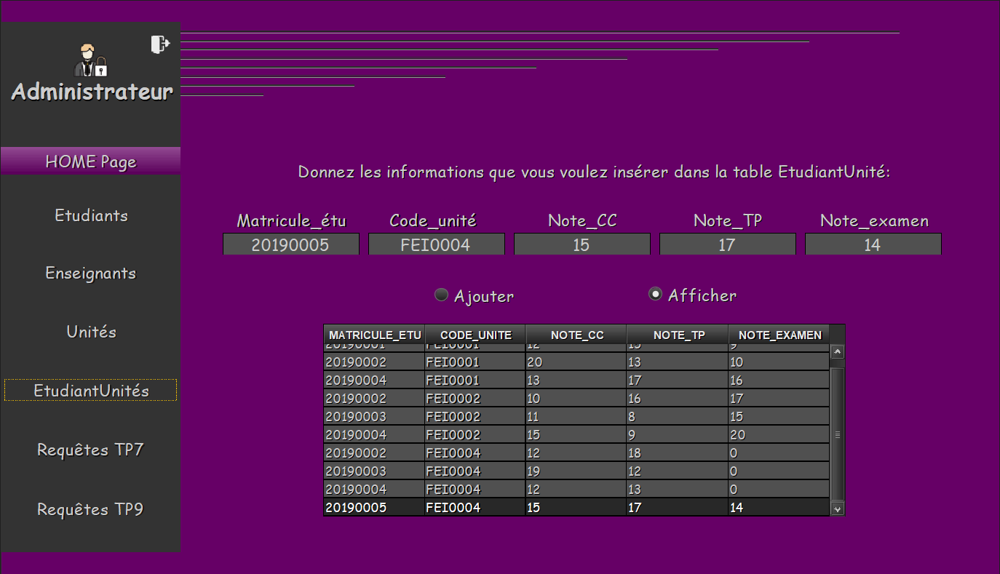 </td>
  </tr>
 </table>
 <table align="center">
  <tr>
    <th colspan="2">  Queries </th>
  </tr>
  <tr>
   <td> 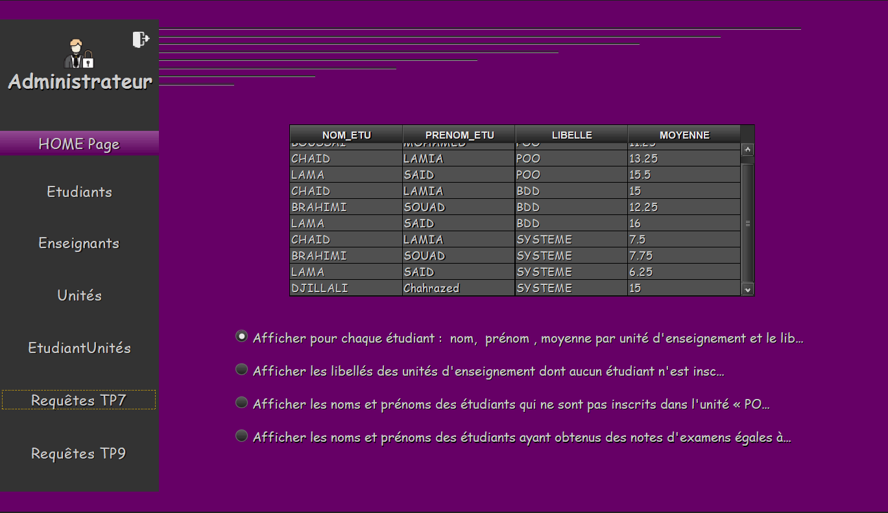  </td> <td> 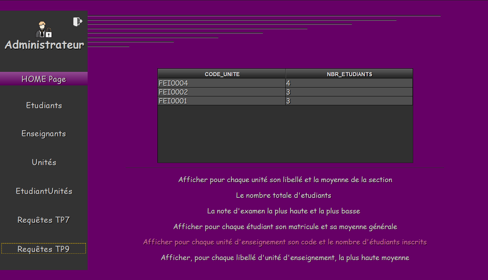 </td>  
  </tr>
</table>

2)  The application is also used by students, where each student can do the following:

     - Access their information by entering their student ID number
<table align="center">
  <tr>
    <th> User </th>
    <th> Password </th>
  </tr>
  <tr>
    <td> Etudiant </td>
    <td> TPEtudiant </td>
  </tr>
</table>

###### Presentation of Interfaces

<table align="center">
  <tr>
   <td> 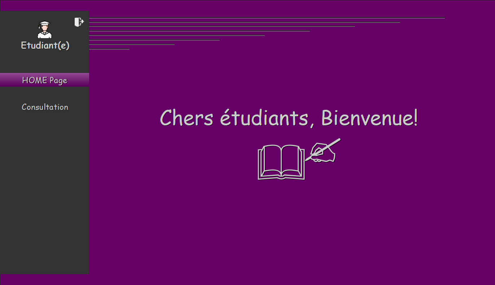  </td> <td> 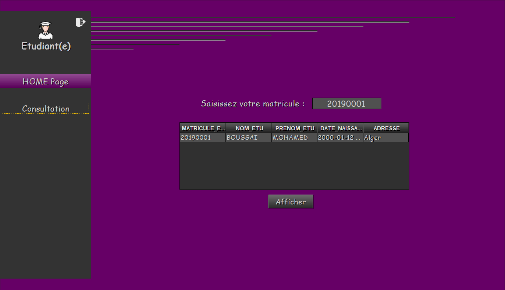 </td>  
  </tr>
</table>

3) The teacher can also access the application and: 

    - Access his information by entering his identifier code.
    - Insert a teacher into the database.
 
<table align="center">
  <tr>
    <th> User </th>
    <th> Password </th>
  </tr>
  <tr>
    <td> Enseignant </td>
    <td> TPEnseignant </td>
  </tr>
</table>

###### Presentation of Interfaces 
   
<table align="center">
   <tr>
    <th colspan="3">  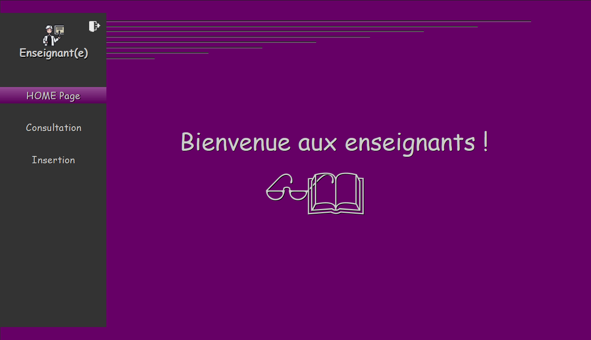 </th>
  </tr>
  <tr>
   <td> 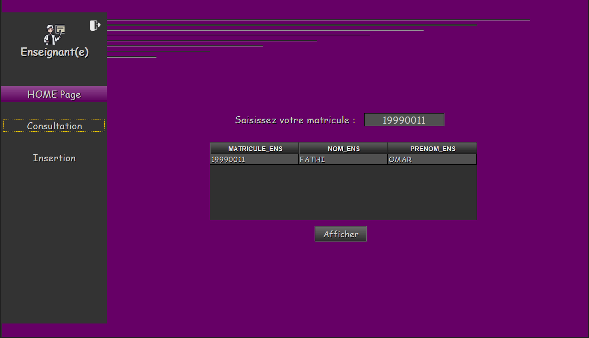  </td>  <td > 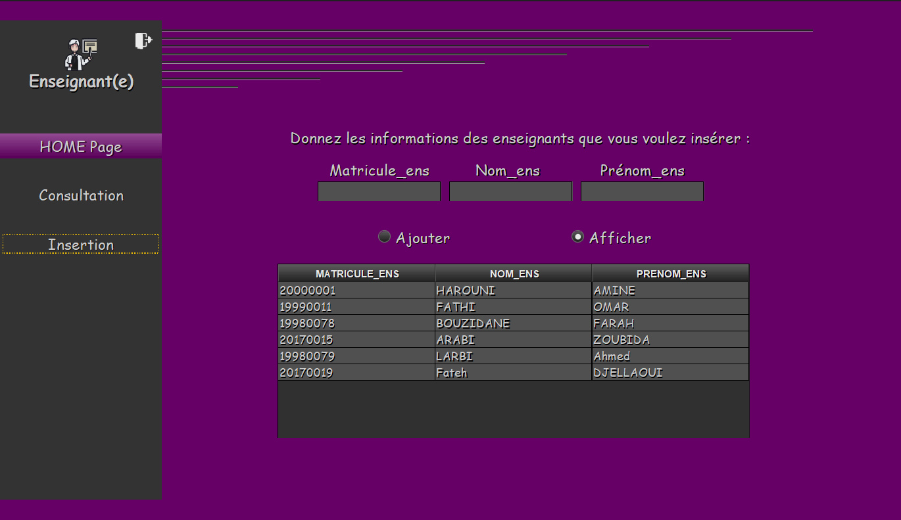 </td>
  </tr>
 </table>

## Database Tables: Relational Schema 

Modeling is a fundamental step in the database design process where, on the one hand, the content of the database is determined, and on the other hand, the nature of the relationships between the main concepts is defined.

- ( * : Designates a Foreign Key / Gray: Primary Key ) 

   - Student (`student_id`, student_name, student_firstname, date_of_birth)
   - Unit (`unit_code`, label, hours_number, teacher_id*)
   - Teacher (`teacher_id`, teacher_name, teacher_firstname, age)
   - StudentUnit (`student_id*, unit_code*`, cc_grade, tp_grade, exam_grade)

  
<table align="center">
  <tr>
    <th>
    📝 All SQL scripts and necessary files for creating the database are available. This small application may have anticipated modifications, such as adding missing functionalities like data modification and deletion.
    </th>
  </tr>
</table>
